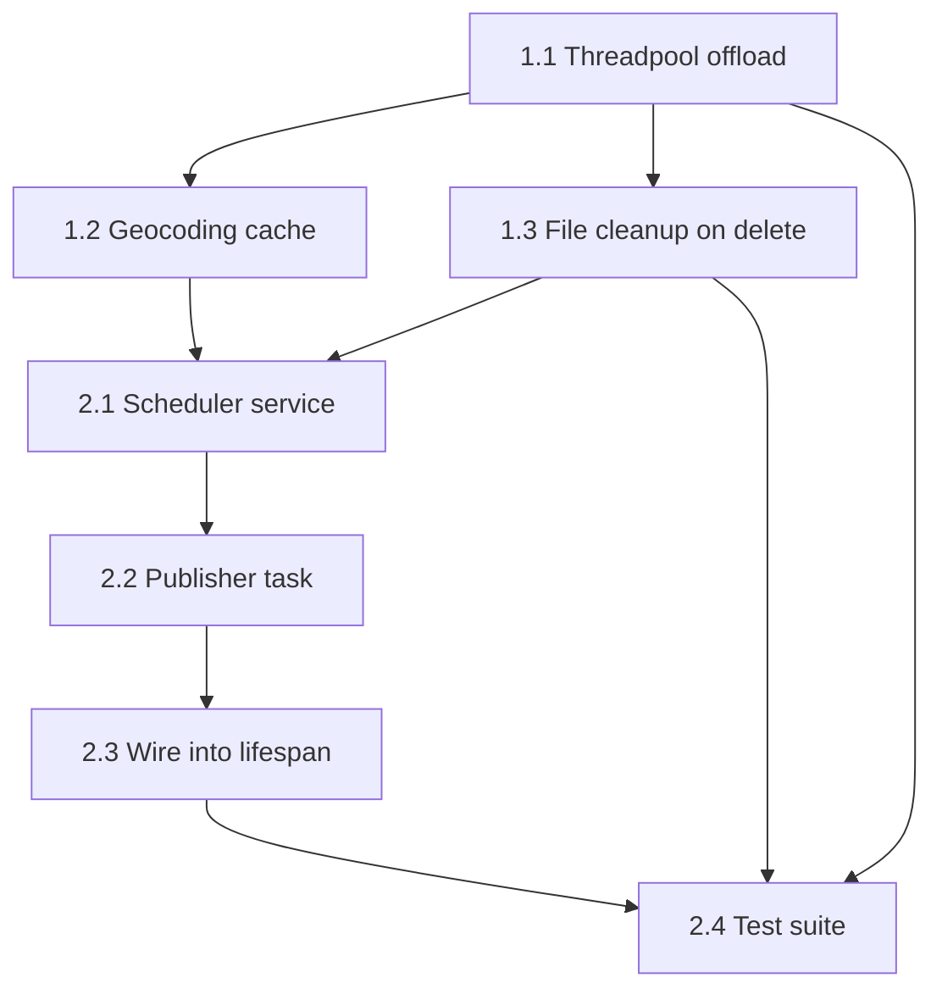

# Implementation Plan: Sprint 1 & 2 — Core Debt & Background Scheduler

> Based on codebase audit — Sabbalens v1.0 MVP

---

## Overview

| Sprint | Focus | Key Deliverables |
|--------|-------|------------------|
| **Sprint 1** | Unblock upload path + fix leaks | Threadpool offload, geocoding cache, file cleanup on delete |
| **Sprint 2** | Background scheduler | APScheduler wiring, publisher task, basic test suite |

---

## Sprint 1: Core Debt & Upload Path Unblocking

### Task 1.1: Offload EXIF & Geocoding to Threadpool

**File:** `app/api/v1/photos.py`

**Changes:**
1. Add import: `from starlette.concurrency import run_in_threadpool`
2. Wrap `extract_exif_data(image_bytes)` → `await run_in_threadpool(extract_exif_data, image_bytes)`
3. Wrap `get_location_name(latitude, longitude)` → `await run_in_threadpool(get_location_name, latitude, longitude)`

**Why:** `exifread` (CPU-bound) + Nominatim HTTP call (I/O-bound, 1s rate limit) currently block the single Uvicorn worker thread. `run_in_threadpool` delegates to the default executor (thread pool), keeping the event loop free.

**Code Diff:**
```python
# Before (lines 20-30)
image_bytes = await file.read()
file_path = storage.save(image_bytes, file.filename)

exif = extract_exif_data(image_bytes)
latitude = exif.get("latitude")
longitude = exif.get("longitude")
location_name = None

if latitude is not None and longitude is not None:
    location_name = get_location_name(latitude, longitude)

# After
image_bytes = await file.read()
file_path = storage.save(image_bytes, file.filename)

exif = await run_in_threadpool(extract_exif_data, image_bytes)
latitude = exif.get("latitude")
longitude = exif.get("longitude")
location_name = None

if latitude is not None and longitude is not None:
    location_name = await run_in_threadpool(get_location_name, latitude, longitude)
```

---

### Task 1.2: Add In-Memory Geocoding Cache

**File:** `app/services/geocoding.py`

**Changes:**
1. Add `functools.lru_cache` decorator to `get_location_name`
2. Round coordinates to 3 decimal places (~110m) before cache lookup to group nearby photos

**Why:** Prevents repeated Nominatim calls for same location (common for photo bursts). 3-decimal rounding = ~110m precision, sufficient for city-level names.

**Code Diff:**
```python
# Add at top
from functools import lru_cache

# Modify function
@lru_cache(maxsize=512)
def get_location_name(lat: float, lon: float) -> str | None:
    # Round to ~110m for cache key stability
    lat_r = round(lat, 3)
    lon_r = round(lon, 3)
    location = reverse_geocode(f"{lat_r}, {lon_r}", language="en")
    # ... rest unchanged
```

**Alternative (if persistence needed):** Add `cached_locations` table to SQLite with `lat_rounded`, `lon_rounded`, `name`, `created_at`. But in-memory LRU is simpler for MVP and survives process lifetime (which is fine — cache rebuilds on restart).

---

### Task 1.3: Implement File Cleanup on DELETE

**Files:** 
- `app/services/storage.py` — add `delete()` method to protocol & implementation
- `app/api/v1/photos.py` — call `storage.delete(photo.file_path)` before `db.delete(photo)`

**Why:** Currently `DELETE /photos/{id}` removes DB record but leaves orphaned file in `./data/uploads`.

**Changes:**

**storage.py:**
```python
class StorageProtocol(Protocol):
    def save(self, file_bytes: bytes, filename: str) -> str: ...
    def get_url(self, file_path: str) -> str: ...
    def delete(self, file_path: str) -> None: ...  # NEW

class LocalStorage:
    # ... existing methods ...
    
    def delete(self, file_path: str) -> None:
        """Delete file from disk. Silently ignores missing files."""
        try:
            Path(file_path).unlink(missing_ok=True)
        except Exception:
            pass  # Log in production, but don't fail the request
```

**photos.py (delete_photo):**
```python
@router.delete("/photos/{photo_id}", status_code=status.HTTP_204_NO_CONTENT)
def delete_photo(photo_id: int, db: Session = Depends(get_database), storage: LocalStorage = Depends(get_storage)):
    photo = db.query(Photo).filter(Photo.id == photo_id).first()
    if not photo:
        raise HTTPException(status_code=404, detail="Photo not found")
    
    # Delete file from disk first
    storage.delete(photo.file_path)
    
    # Then delete DB record
    db.delete(photo)
    db.commit()
```

---

## Sprint 2: Background Scheduler (APScheduler)

### Task 2.1: Create Scheduler Service

**New File:** `app/services/scheduler.py`

```python
from apscheduler.schedulers.asyncio import AsyncIOScheduler
from apscheduler.triggers.interval import IntervalTrigger
from app.core.config import settings

scheduler = AsyncIOScheduler()

def init_scheduler():
    """Initialize and return the scheduler. Call once at startup."""
    # Job will be added in publisher.py to avoid circular imports
    return scheduler

def start_scheduler():
    scheduler.start()

def shutdown_scheduler():
    scheduler.shutdown(wait=True)
```

---

### Task 2.2: Create Publisher Task

**New File:** `app/tasks/publisher.py`

```python
from datetime import datetime, timezone
from sqlalchemy.orm import Session
from app.core.database import SessionLocal
from app.models.photo import Photo, PhotoStatus
from app.services.scheduler import scheduler

def publish_scheduled_photos():
    """Job: find photos due for publishing and process them."""
    db: Session = SessionLocal()
    try:
        now = datetime.now(timezone.utc)
        due_photos = (
            db.query(Photo)
            .filter(Photo.status == PhotoStatus.scheduled)
            .filter(Photo.scheduled_at <= now)
            .all()
        )
        
        for photo in due_photos:
            # TODO: Replace with actual Instagram Graph API call
            # For now: mock publish
            photo.status = PhotoStatus.published
            photo.published_at = datetime.now(timezone.utc)
            # photo.instagram_media_id = response.media_id  # when real API
            db.commit()
            
    except Exception as e:
        # In production: log to Sentry/structured logger
        print(f"[publisher] Error: {e}")
        db.rollback()
    finally:
        db.close()

def register_publisher_job():
    """Register the recurring publisher job (runs every 60s)."""
    scheduler.add_job(
        publish_scheduled_photos,
        IntervalTrigger(seconds=60),
        id="publish_scheduled_photos",
        replace_existing=True,
        max_instances=1,  # Prevent overlapping runs
    )
```

---

### Task 2.3: Wire Scheduler into Lifespan

**File:** `app/main.py`

```python
from contextlib import asynccontextmanager
from pathlib import Path
from fastapi import FastAPI
from fastapi.staticfiles import StaticFiles
from app.core.config import settings
from app.core.database import engine, Base
from app.api.v1.router import router as api_v1_router
from app.services.storage import storage
from app.services.scheduler import init_scheduler, start_scheduler, shutdown_scheduler
from app.tasks.publisher import register_publisher_job


@asynccontextmanager
async def lifespan(app: FastAPI):
    Base.metadata.create_all(bind=engine)
    
    # Initialize and start scheduler
    init_scheduler()
    register_publisher_job()
    start_scheduler()
    
    yield
    
    # Clean shutdown
    shutdown_scheduler()


app = FastAPI(title=settings.app_name, debug=settings.debug, lifespan=lifespan)

app.mount("/uploads", StaticFiles(directory=settings.upload_dir), name="uploads")
app.include_router(api_v1_router)

@app.get("/health")
def health():
    return {"status": "ok"}

# Scheduler app at /app/
app_dir = Path(__file__).parent.parent / "frontend_v1"
app.mount("/app", StaticFiles(directory=app_dir, html=True), name="frontend")

# Landing page at root (/)
landing_dir = Path(__file__).parent.parent / "frontend_landing"
app.mount("/", StaticFiles(directory=landing_dir, html=True), name="landing")
```

---

## Sprint 2 (cont): Basic Test Suite

### Task 2.4: Add Pytest Configuration & Test File

**New File:** `tests/conftest.py`
```python
import pytest
from httpx import AsyncClient
from app.main import app

@pytest.fixture(scope="session")
def anyio_backend():
    return "asyncio"

@pytest.fixture
async def client():
    async with AsyncClient(app=app, base_url="http://test") as ac:
        yield ac
```

**New File:** `tests/test_photos.py`
```python
import pytest
from httpx import AsyncClient
import io
from PIL import Image
import piexif

def create_test_image_with_gps(lat=37.7749, lon=-122.4194) -> bytes:
    """Generate a JPEG with GPS EXIF for testing."""
    img = Image.new("RGB", (400, 300), color="blue")
    buf = io.BytesIO()
    
    def dms(d):
        d = abs(d)
        return [(int(d), 1), (int((d - int(d)) * 60), 1), (int(((d - int(d)) * 60 - int((d - int(d)) * 60)) * 60 * 10000), 10000)]
    
    exif = {
        "GPS": {
            piexif.GPSIFD.GPSLatitudeRef: "N" if lat >= 0 else "S",
            piexif.GPSIFD.GPSLatitude: dms(lat),
            piexif.GPSIFD.GPSLongitudeRef: "E" if lon >= 0 else "W",
            piexif.GPSIFD.GPSLongitude: dms(lon),
        }
    }
    img.save(buf, format="JPEG", exif=piexif.dump(exif))
    return buf.getvalue()


class TestPhotoUpload:
    @pytest.mark.asyncio
    async def test_upload_valid_image_with_gps(self, client: AsyncClient):
        image_bytes = create_test_image_with_gps()
        files = {"file": ("test.jpg", image_bytes, "image/jpeg")}
        
        resp = await client.post("/api/v1/photos/upload", files=files)
        
        assert resp.status_code == 201
        data = resp.json()
        assert data["status"] == "draft"
        assert data["latitude"] == pytest.approx(37.7749, abs=0.001)
        assert data["longitude"] == pytest.approx(-122.4194, abs=0.001)
        assert data["location_name"] is not None
        assert "San Francisco" in data["location_name"]

    @pytest.mark.asyncio
    async def test_upload_invalid_mime_type(self, client: AsyncClient):
        files = {"file": ("test.txt", b"not an image", "text/plain")}
        
        resp = await client.post("/api/v1/photos/upload", files=files)
        
        assert resp.status_code == 400
        assert "image" in resp.json()["detail"].lower()

    @pytest.mark.asyncio
    async def test_upload_invalid_extension(self, client: AsyncClient):
        files = {"file": ("test.exe", b"fake", "application/octet-stream")}
        
        resp = await client.post("/api/v1/photos/upload", files=files)
        
        assert resp.status_code == 400


class TestPhotoCRUD:
    @pytest.mark.asyncio
    async def test_patch_updates_caption_and_schedule(self, client: AsyncClient):
        # First upload
        image_bytes = create_test_image_with_gps()
        files = {"file": ("test.jpg", image_bytes, "image/jpeg")}
        upload_resp = await client.post("/api/v1/photos/upload", files=files)
        photo_id = upload_resp.json()["id"]
        
        # Patch caption + schedule
        patch_resp = await client.patch(
            f"/api/v1/photos/{photo_id}",
            json={
                "caption": "Test caption",
                "status": "scheduled",
                "scheduled_at": "2099-12-31T23:59:00Z",
            },
        )
        
        assert patch_resp.status_code == 200
        data = patch_resp.json()
        assert data["caption"] == "Test caption"
        assert data["status"] == "scheduled"
        assert data["scheduled_at"] is not None


class TestPhotoDelete:
    @pytest.mark.asyncio
    async def test_delete_removes_file_from_disk(self, client: AsyncClient):
        image_bytes = create_test_image_with_gps()
        files = {"file": ("test.jpg", image_bytes, "image/jpeg")}
        upload_resp = await client.post("/api/v1/photos/upload", files=files)
        photo_id = upload_resp.json()["id"]
        file_path = upload_resp.json()["file_path"]
        
        # Verify file exists
        import os
        assert os.path.exists(file_path)
        
        # Delete
        del_resp = await client.delete(f"/api/v1/photos/{photo_id}")
        assert del_resp.status_code == 204
        
        # Verify file gone
        assert not os.path.exists(file_path)
```

**New File:** `requirements-dev.txt` (or add to `requirements.txt`)
```
pytest==8.3.*
pytest-asyncio==0.23.*
httpx==0.28.*
pillow==10.4.*
piexif==1.1.*
```

---

## Execution Order & Dependencies



**Recommended sequence:**
1. **1.1** (unblocks upload immediately)
2. **1.2** (quick win, same file area)
3. **1.3** (prevents disk leak)
4. **2.1 → 2.2 → 2.3** (scheduler stack, depends on each other)
5. **2.4** (tests validate all above)

---

## Open Questions Before Implementation

| Question | Options | Impact |
|----------|---------|--------|
| **Geocoding cache persistence?** | In-memory LRU (simpler) vs SQLite table (survives restart) | In-memory fine for MVP; add table later if needed |
| **Scheduler timezone?** | UTC only (current) vs configurable | UTC is correct for Instagram API; keep as-is |
| **Publisher error handling?** | Mark `failed` + retry logic vs just log | Add `failed` status transition + `retry_count` column later |
| **Test image generation?** | `piexif` + `Pillow` in test vs fixture file | Generated is self-contained; adds 2 test deps |

---

## File Touch Summary

| File | Sprint | Change Type |
|------|--------|-------------|
| `app/api/v1/photos.py` | 1 | Modify upload + delete |
| `app/services/geocoding.py` | 1 | Add `@lru_cache` |
| `app/services/storage.py` | 1 | Add `delete()` method |
| `app/services/scheduler.py` | 2 | New file |
| `app/tasks/publisher.py` | 2 | New file |
| `app/main.py` | 2 | Wire lifespan |
| `tests/conftest.py` | 2 | New file |
| `tests/test_photos.py` | 2 | New file |
| `requirements.txt` / `requirements-dev.txt` | 2 | Add test deps |

---

*Ready to execute. Which task should we start with?*