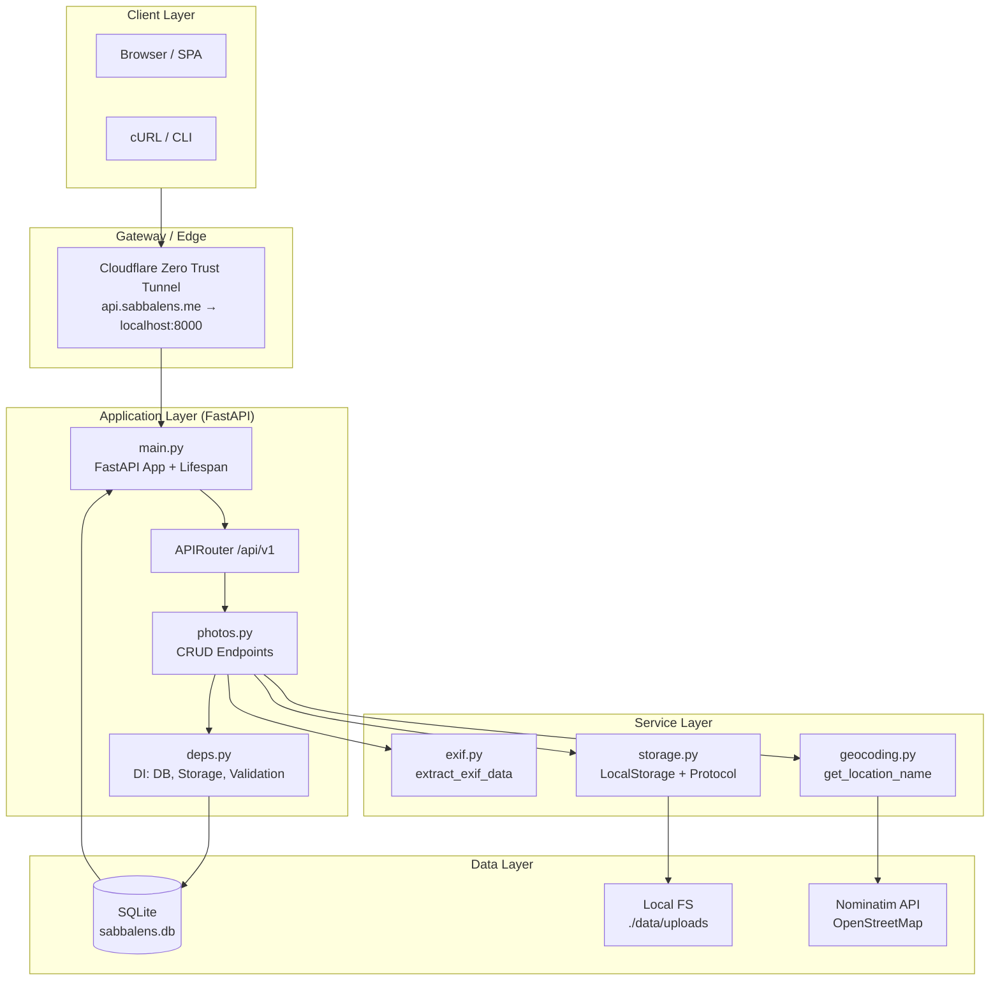
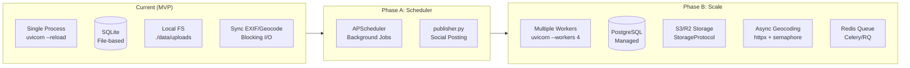
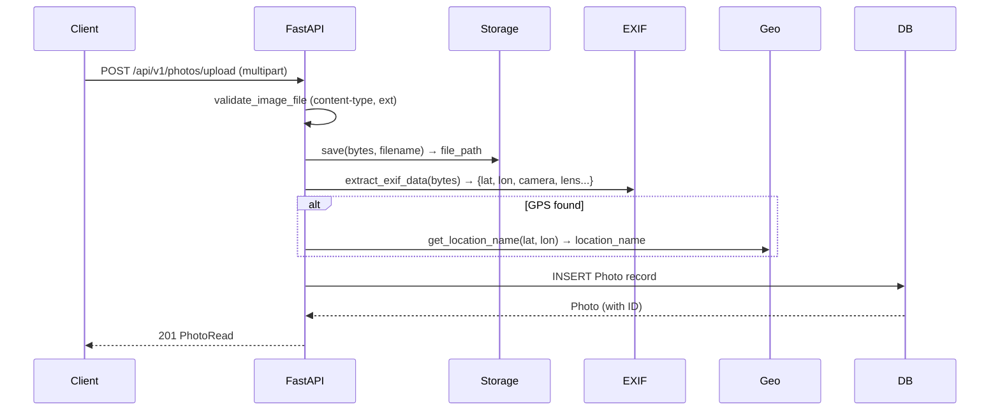
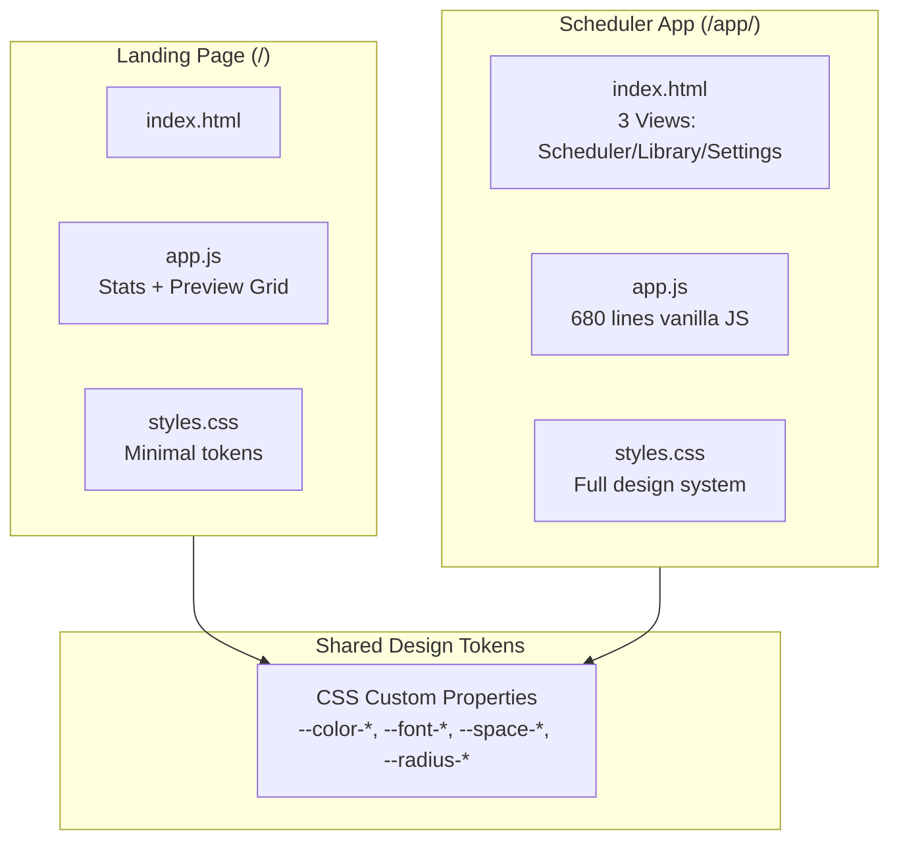
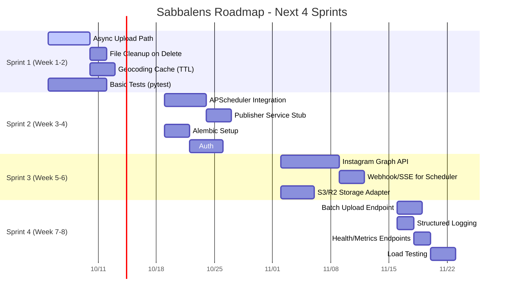

# Sabbalens — Comprehensive Codebase Overview

> **Geo-Aware Photo Pipeline** | FastAPI + SQLite + Vanilla JS | Dark Developer/Builder Aesthetic

---

## Table of Contents

1. [Executive Summary](#executive-summary)
2. [Software Architect Perspective](#software-architect-perspective)
3. [Software Developer Perspective](#software-developer-perspective)
4. [Product Manager Perspective](#product-manager-perspective)
4. [Actionable Insights & Questions](#actionable-insights--questions)

---

## Executive Summary

**Sabbalens** is a FastAPI-based backend service with a vanilla JavaScript frontend that automates the photo-to-social-post pipeline:

| Capability | Implementation |
|------------|----------------|
| **Photo Upload** | Multipart REST endpoint (`POST /api/v1/photos/upload`) |
| **EXIF Extraction** | `exifread` parses GPS + camera metadata from binary JPEG |
| **Reverse Geocoding** | Nominatim (OpenStreetMap) via `geopy` with rate limiting |
| **Persistence** | SQLite + SQLAlchemy 2.0 (async-ready) |
| **Static Serving** | FastAPI `StaticFiles` mount at `/uploads` |
| **Frontend** | Two SPA mounts: `/app` (scheduler) + `/` (landing) |
| **Deployment** | Docker Compose, Cloudflare Zero Trust Tunnel → WSL2 |

**Current State:** MVP complete. Scheduler & social publishing (Instagram Graph API) are next roadmap items.

---

## Software Architect Perspective

### System Architecture



### Architecture Patterns

| Pattern | Implementation | File |
|---------|----------------|------|
| **Layered Architecture** | `core` → `models` → `schemas` → `services` → `api` | `app/` structure |
| **Dependency Injection** | FastAPI `Depends()` for DB, storage, validation | `app/api/deps.py` |
| **Repository Pattern (implicit)** | SQLAlchemy `Session` per request via `get_db()` | `app/core/database.py` |
| **Protocol/Strategy** | `StorageProtocol` for swappable backends (S3/R2) | `app/services/storage.py:8-11` |
| **Lifespan Events** | `@asynccontextmanager` for DB init on startup | `app/main.py:11-15` |
| **Static File Mounting** | Three mounts: `/uploads`, `/app`, `/` (order matters!) | `app/main.py:19-38` |

### Scalability Analysis



**Bottlenecks Identified:**
1. **Sync I/O in upload path** — EXIF parsing + Nominatim call block the request thread
2. **SQLite write contention** — Single writer, no connection pooling benefit
3. **No caching** — Repeated geocoding for same coordinates
4. **Single-process** — No horizontal scaling without session affinity

### Data Flow: Photo Upload



---

## Software Developer Perspective

### Code Structure

```
app/
├── main.py                 # FastAPI app, lifespan, static mounts (ORDER MATTERS)
├── core/
│   ├── config.py           # Pydantic Settings (.env, extra="ignore")
│   └── database.py         # SQLAlchemy engine, SessionLocal, Base, get_db()
├── models/
│   └── photo.py            # Photo ORM + PhotoStatus enum
├── schemas/
│   └── photo.py            # Pydantic: PhotoBase, Create, Update, Read, Batch
├── services/
│   ├── exif.py             # extract_exif_data(bytes) → dict
│   ├── geocoding.py        # Rate-limited Nominatim reverse geocode
│   └── storage.py          # LocalStorage + StorageProtocol
├── api/
│   ├── deps.py             # FastAPI deps: get_db, get_storage, validate_image_file
│   └── v1/
│       ├── router.py       # APIRouter prefix="/api/v1"
│       └── photos.py       # CRUD endpoints
└── tasks/
    └── __init__.py         # Future: APScheduler publisher
```

### Key Implementation Details

#### 1. Configuration (`app/core/config.py`)
- **Pydantic Settings v2** with `SettingsConfigDict`
- `extra="ignore"` — unknown `.env` keys don't crash startup
- Path-based `upload_dir` with `Path` type (auto-expanded in Docker)

#### 2. Database (`app/core/database.py`)
- SQLite with `check_same_thread=False` for multi-threaded uvicorn
- `SessionLocal` factory, `get_db()` generator for DI
- `Base.metadata.create_all()` in lifespan (dev-friendly, not for prod)

#### 3. Photo Model (`app/models/photo.py`)
```python
class PhotoStatus(str, enum.Enum):
    draft = "draft"
    scheduled = "scheduled"
    published = "published"
    failed = "failed"

class Photo(Base):
    # Core
    id, filename, file_path
    # GPS
    latitude, longitude, location_name
    # EXIF
    camera, lens, focal_length, exposure_time, aperture, iso
    # Scheduling
    status, caption, scheduled_at, published_at
    # Social
    instagram_media_id, destinations
    # Audit
    created_at
```

#### 4. EXIF Extraction (`app/services/exif.py`)
- Uses `exifread.process_file()` on `io.BytesIO`
- Parses GPS DMS → decimal degrees
- Extracts: Make/Model, Lens, FocalLength, ExposureTime, FNumber, ISO
- **No error handling for corrupt EXIF** — returns empty dict silently

#### 5. Geocoding (`app/services/geocoding.py`)
- `geopy.Nominatim` with `RateLimiter(min_delay_seconds=1.0)`
- Returns city/town/village/state/country fallback chain
- **No caching** — every upload with GPS hits Nominatim

#### 6. Storage Abstraction (`app/services/storage.py`)
```python
class StorageProtocol(Protocol):
    def save(self, file_bytes: bytes, filename: str) -> str: ...
    def get_url(self, file_path: str) -> str: ...

class LocalStorage:
    # UUID hex + original extension
    # Returns absolute file path
    # get_url() → "/uploads/{filename}"
```

#### 7. API Endpoints (`app/api/v1/photos.py`)
| Method | Path | Description |
|--------|------|-------------|
| POST | `/photos/upload` | Upload → EXIF → Geocode → Persist → 201 |
| GET | `/photos` | List with `status`, `limit`, `offset` |
| GET | `/photos/{id}` | Single photo |
| PATCH | `/photos/{id}` | Update caption/status/scheduled_at/destinations |
| DELETE | `/photos/{id}` | Delete record (file remains on disk!) |

**Missing:** File cleanup on DELETE, batch upload, pagination metadata

### Frontend Architecture



#### Scheduler JS Modules (`frontend_v1/app.js`)
| Module | Lines | Responsibility |
|--------|-------|----------------|
| Toast System | 20-60 | Non-blocking notifications (replaces `alert()`) |
| URL/Fetch Helpers | 63-106 | `fetchPhoto`, `parseServerDate`, `photoUrl` |
| Render Photo | 113-166 | Populates scheduler view from `PhotoRead` |
| Char Count | 173-187 | Live caption length with warn/over states |
| Hashtags | 194-225 | Auto-generate from location/camera + defaults |
| API Update | 232-252 | `PATCH /photos/{id}` with optimistic UI |
| Destinations | 259-262 | Checkbox group → comma-separated string |
| Schedule/Publish | 269-313 | `handleSchedule` / `handlePublishNow` |
| Import/Upload | 320-346 | Dialog + drag-drop + `POST /photos/upload` |
| Drag & Drop | 353-392 | Preview area drop zone with visual feedback |
| Views/Tabs | 395-432 | Hash-based routing (`#scheduler`, `#library`, `#settings`) |
| Library | 438-576 | Grid, filters, counts, card rendering, open photo |
| Settings | 583-601 | Health check + photo count |
| Init | 608-678 | Event binding, URL param handling, defaults |

### Development Workflow

```bash
# Local
python -m venv venv && source venv/bin/activate
pip install -r requirements.txt
cp .env.example .env
python3 main.py
# → http://localhost:8000 (landing)
# → http://localhost:8000/app/ (scheduler)
# → http://localhost:8000/docs (Swagger)

# Docker
cp .env.example .env
docker compose up --build
```

### Code Quality Observations

| Aspect | Status | Notes |
|--------|--------|-------|
| **Type Hints** | ✅ Excellent | Full Pydantic + SQLAlchemy 2.0 typing |
| **Error Handling** | ⚠️ Partial | No global exception handler; EXIF/Geo fail silently |
| **Testing** | ❌ Missing | `tests/` directory empty |
| **Async/Await** | ⚠️ Partial | Upload is async but EXIF/Geo/DB are sync |
| **Security** | ⚠️ Basic | File type validation only; no auth, rate limiting, CORS config |
| **Logging** | ❌ Missing | No structured logging |
| **Migrations** | ❌ Missing | `create_all()` only; no Alembic |

---

## Product Manager Perspective

### User Flows

```mermaid
flowchart TD
    A[User lands on /] --> B{Has photos?}
    B -->|No| C[Empty landing → Click Open Scheduler]
    B -->|Yes| D[See stats + recent previews]
    D --> E[Click preview → /app/?id=X]
    C --> F[/app/ Scheduler View]
    F --> G[Drop/Import photo]
    G --> H[EXIF extracted → Location shown]
    H --> I[Enter caption + hashtags]
    I --> J[Select destinations]
    J --> K{Schedule or Publish?}
    K -->|Schedule| L[Pick date/time UTC → Status: scheduled]
    K -->|Publish Now| M[Status: published<br/>(mock - no real API)]
    L --> N[Library view shows scheduled]
    M --> N
    N --> O[Settings: health + count]
```

### Feature Matrix

| Feature | Status | API | Frontend | Notes |
|---------|--------|-----|----------|-------|
| Photo Upload | ✅ | POST /upload | Drag-drop + dialog | 10MB limit, type validation |
| EXIF GPS Extraction | ✅ | Auto on upload | Shows coords + location | No map preview |
| EXIF Camera Data | ✅ | Auto on upload | Shows body/lens/exposure | Read-only |
| Reverse Geocoding | ✅ | Auto on upload | Location name badge | Nominatim, 1 req/sec |
| Photo List/Filter | ✅ | GET /photos | Library tab with chips | Status filter + counts |
| Photo Detail | ✅ | GET /photos/{id} | Click card → scheduler | URL deep-linkable (`?id=`) |
| Caption Edit | ✅ | PATCH /photos/{id} | Textarea + char count | 2200 char limit (IG) |
| Status Workflow | ✅ | PATCH status | Schedule/Publish buttons | draft → scheduled → published |
| Destinations | ✅ | PATCH destinations | Checkbox chips | Instagram/Threads/Bluesky |
| Scheduling (UTC) | ✅ | PATCH scheduled_at | Date + time inputs | Stored as ISO UTC |
| Social Publishing | ❌ | — | Mock only | Roadmap Phase B |
| Batch Upload | ❌ | Schema only | — | `BatchUploadRequest` defined |
| Auth/Users | ❌ | — | — | Single-user MVP |
| Webhooks | ❌ | — | — | For scheduler callbacks |

### Design System Compliance

The frontend implements the **Dark Developer/Builder** spec from `DESIGN.md`:

| Token Category | Implemented | Notes |
|----------------|-------------|-------|
| Colors (8 tokens) | ✅ | `--color-bg` through `--color-error` |
| Typography (2 fonts) | ✅ | Geist + JetBrains Mono via Google Fonts |
| Spacing (4px base) | ✅ | `--space-1` through `--space-12` |
| Radius (6 tokens) | ✅ | `--radius-xs` through `--radius-full` |
| Shadows (6 tokens) | ✅ | Including `--shadow-focus` (red ring) |
| Motion (6 tokens) | ✅ | Respects `prefers-reduced-motion` |
| Components | ✅ | Button, Input, Card, Chip, Dropzone, Toast, Dialog, StatusBadge |
| Accessibility | ✅ | ARIA labels, focus rings, contrast, color-blind safe status chips |

**Deviation:** Landing page has duplicate token subset (should import shared CSS).

### Business Alignment

| Goal | Current Support | Gap |
|------|-----------------|-----|
| **Photographer workflow** | Upload → Location → Schedule | No map, no EXIF map preview |
| **Multi-platform posting** | UI ready (3 destinations) | No API integrations |
| **Automation** | Manual schedule only | No cron/APScheduler yet |
| **Reliability** | SQLite local | No backup, no replication |
| **Observability** | `/health` only | No metrics, tracing, Sentry |

---

## Actionable Insights & Questions

### Technical Debt (Prioritized)

| # | Issue | Impact | Effort | File(s) |
|---|-------|--------|--------|---------|
| 1 | **Sync EXIF + Geocode blocks upload** | Latency, throughput | Medium | `photos.py:14-50`, `exif.py`, `geocoding.py` |
| 2 | **DELETE doesn't remove file** | Storage leak | Low | `photos.py:86-92` |
| 3 | **No geocoding cache** | Nominatim rate limits, latency | Low | `geocoding.py` |
| 4 | **No tests** | Regression risk | Medium | `tests/` (empty) |
| 5 | **No Alembic migrations** | Schema changes break prod | Medium | — |
| 6 | **Landing CSS duplicates tokens** | Drift risk | Low | `frontend_landing/styles.css` |
| 7 | **No auth/CORS/rate limiting** | Security | Medium | `main.py`, `deps.py` |
| 8 | **No structured logging** | Debugging prod issues | Low | — |
| 9 | **File validation only by extension** | Security | Low | `deps.py:16-24` |
| 10 | **Single-threaded SQLite** | Scale ceiling | High (arch) | `database.py` |

### Architecture Decisions Needed

| Decision | Options | Recommendation |
|----------|---------|----------------|
| **Async vs Sync** | Keep sync, add thread pool / Migrate to async SQLAlchemy + httpx | Start with `run_in_threadpool` for EXIF/Geo; plan async migration |
| **Scheduler** | APScheduler in-process / Celery + Redis / Separate worker service | APScheduler in-process for Phase A; Celery for Phase B |
| **Storage Backend** | Local only / S3 / Cloudflare R2 / Abstract with protocol | Implement `S3Storage`/`R2Storage` now (protocol exists) |
| **Auth** | None / API Key / OAuth (Google/GitHub) / JWT | API Key for server-to-server; OAuth for future multi-user |
| **Database** | SQLite / PostgreSQL / Turso (libSQL) | PostgreSQL for prod; Turso for edge sync |
| **Frontend Framework** | Vanilla JS / React / Svelte / HTMX | Stay vanilla for v1; evaluate React if team grows |

### Product Questions

1. **Single-user vs Multi-tenant?** Current code assumes single user. If multi-user:
   - Add `User` model, `Photo.user_id` FK
   - Auth middleware in `deps.py`
   - Row-level security

2. **Instagram Graph API Scope?** Need `instagram_content_publish`, `pages_show_list`, `pages_read_engagement`. Requires Business Verification.

3. **Video Support?** Currently image-only. HEIC supported but not processed. Video needs different EXIF handling + transcoding.

4. **Timezone Handling?** All times stored as UTC. Frontend shows "Time (UTC)" label. Should we add user TZ preference?

5. **Webhook/Callback for Scheduler?** When APScheduler fires, how to notify frontend? WebSocket? SSE? Polling?

6. **Analytics/Insights?** Track: uploads/day, publish success rate, best posting times. Need event logging.

7. **Mobile App?** PWA? React Native? Current responsive CSS works but no offline/cache.

### Immediate Next Steps (Sprint-Ready)



### Open Questions for Stakeholders

| Question | Context | Decision Needed By |
|----------|---------|-------------------|
| Target launch date? | Drives scope cuts | Sprint 1 |
| Instagram Business Verification status? | Blocks Phase B | Sprint 2 |
| Multi-user or single-user? | Data model, auth | Sprint 1 |
| Preferred cloud provider? | S3 vs R2 vs Azure Blob | Sprint 3 |
| Budget for managed services? | Postgres, Redis, Sentry | Sprint 2 |
| Team size for frontend? | Vanilla JS vs framework | Sprint 3 |

---

## Appendix: File Inventory

### Backend (Python)
| File | Lines | Purpose |
|------|-------|---------|
| `main.py` | 5 | Entry point |
| `app/main.py` | 38 | FastAPI app + mounts |
| `app/core/config.py` | 31 | Settings |
| `app/core/database.py` | 18 | SQLAlchemy setup |
| `app/models/photo.py` | 38 | ORM model |
| `app/schemas/photo.py` | 49 | Pydantic schemas |
| `app/services/exif.py` | 51 | EXIF extraction |
| `app/services/geocoding.py` | 26 | Reverse geocode |
| `app/services/storage.py` | 29 | Storage abstraction |
| `app/api/deps.py` | 25 | DI dependencies |
| `app/api/v1/router.py` | 5 | Router mount |
| `app/api/v1/photos.py` | 92 | CRUD endpoints |

### Frontend (Vanilla JS + CSS)
| File | Lines | Purpose |
|------|-------|---------|
| `frontend_v1/index.html` | 287 | Scheduler SPA (3 views) |
| `frontend_v1/app.js` | 680 | Scheduler logic |
| `frontend_v1/styles.css` | 1352 | Full design system |
| `frontend_landing/index.html` | 34 | Landing page |
| `frontend_landing/app.js` | 122 | Landing logic |
| `frontend_landing/styles.css` | 141 | Landing styles (duplicate tokens) |

### Infrastructure
| File | Purpose |
|------|---------|
| `Dockerfile` | Multi-stage-ready Python 3.12 slim |
| `docker-compose.yml` | Single service with volume mount |
| `.env.example` | Configuration template |
| `requirements.txt` | 11 dependencies |
| `DESIGN.md` | Complete design system spec |
| `README.md` | User-facing documentation |

---

*Generated from codebase analysis — **Sabbalens v1.0 MVP** — Last updated: 2026-10-05*
